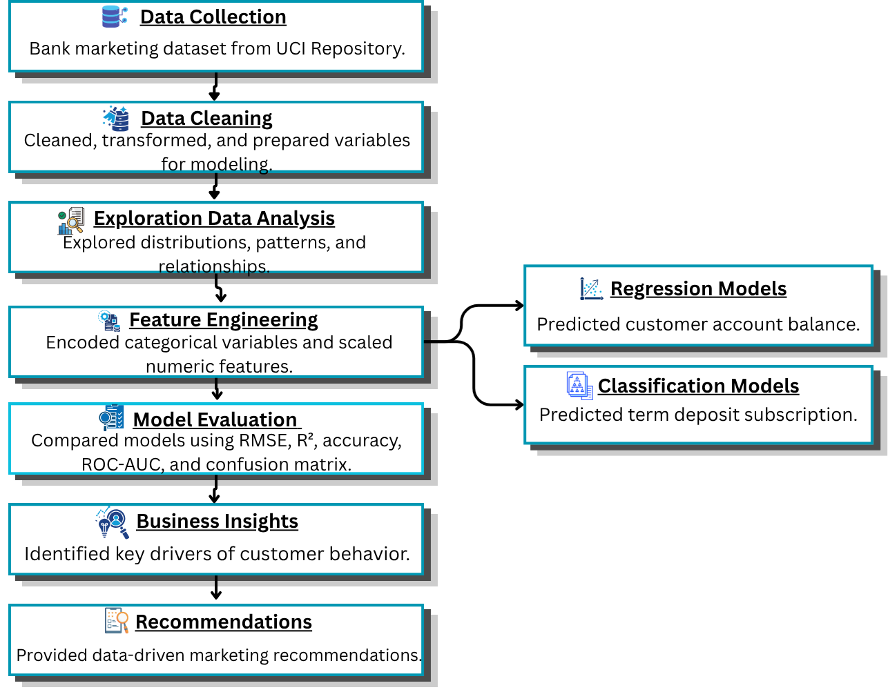
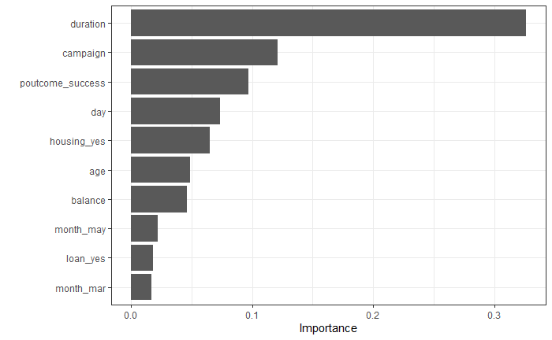
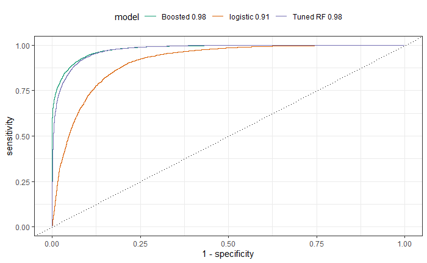

#  Predictive Customer Analytics for Banking Campaigns

> **Predicting Bank Customer Behavior: A Data-Driven Approach to Campaign Effectiveness and Customer Segmentation**

---

##  Overview

Banks invest heavily in direct marketing campaigns to promote financial products, but broad customer targeting often leads to low conversion rates and inefficient use of marketing resources. Applying predictive analytics and machine learning to identify the factors influencing customer account balances and predict which customers are most likely to subscribe to a term deposit enables organizations to make more informed, data-driven marketing decisions. Through the application and comparison of multiple regression and classification models, this project generates actionable insights that improve customer segmentation, optimize campaign strategies, and enhance the effectiveness of marketing resource allocation.

The findings demonstrate how predictive analytics, supported by machine learning techniques, can enable more targeted customer engagement, improve campaign performance, and provide a scalable framework for data-driven decision-making in the banking sector.

##  Business Problem

The success of direct marketing campaigns depends on an organization's ability to identify high-value customers and accurately predict which customers are most likely to respond to a product offer. This raises two critical business questions:

Which customers are financially valuable?
Which customers are most likely to subscribe to a term deposit?

To address these questions, this project develops and evaluates predictive analytics solutions that estimate customer account balances and predict term deposit subscriptions using demographic and campaign data.

Without predictive analytics, marketing teams often rely on broad demographic assumptions, historical averages, and manual customer segmentation. These approaches are time-consuming, inconsistent, and increasingly ineffective in today's data-driven business environment, resulting in inefficient resource allocation and lower campaign effectiveness.

**This project addresses two key business challenges:**

*Gap 1: Lack of an Account Balance Prediction Model*

The bank lacks a reliable method for predicting individual customer account balances using demographic and campaign data. As a result, high-value customers cannot be identified and prioritized effectively before marketing campaigns begin.

*Gap 2: Lack of a Subscription Prediction Model*

The bank also lacks a predictive model to identify customers most likely to subscribe to a term deposit. Without this capability, marketing campaigns target large customer groups indiscriminately, leading to unnecessary contact costs, inefficient use of marketing resources, and missed revenue opportunities.

**Business Risks of Inaction**

Without a predictive analytics solution, the organization risks:

1. Spending marketing budgets on low-probability customers.
2. Overlooking high-value customers due to limited financial profiling.
3. Contacting customers too frequently or at ineffective intervals.
4. Lacking a data-driven approach to prioritize and segment marketing campaigns.

   
##  Analytical Workflow

##  Business Insights 

*From the Regression Track — What drives account balance?*

1. Age is the dominant predictor of account balance and the relationship is exponential, not linear. Balance grows slowly in younger customers and accelerates significantly with age. Linear models systematically underestimate balance for older customers.
2. Contact duration has a positive effect on balance, customers who engage in longer interactions tend to have higher balances, suggesting that engagement quality reflects financial capacity.
3. High campaign frequency correlates with lower balance, customers contacted more aggressively during campaigns tend to hold lower balances, suggesting the bank may already be over-targeting lower-value segments.
4. Previous contacts show diminishing returns beyond a certain threshold, prior contacts no longer add predictive value for balance, indicating saturation effects in outreach.
5. The low R² across all regression models (max 0.015) signals that key financial variables — income, credit score, savings history — are absent from the dataset and would be essential for a production-ready balance predictor.

*From the Classification Track — What drives subscription?*

1. Duration is the single strongest predictor of subscription by a wide margin. A longer call duration signals genuine customer interest and is the clearest leading indicator of a likely subscriber.
2. Campaign frequency negatively impacts subscription likelihood, customers contacted fewer times during the current campaign are more likely to subscribe. Over-contacting actively reduces conversion.
3. Previous campaign success (poutcome_success) is a strong positive signal, customers who responded positively to prior campaigns are significantly more likely to subscribe again, making re-targeting a high-return strategy.
4. Housing loan status influences subscription, customers with a housing loan showed different subscription patterns, suggesting financial obligations are a meaningful segmentation variable.
5. Month of contact has minimal predictive power, timing of outreach matters far less than the quality and history of customer engagement.

##  Business Recommendations

1. Prioritize call quality over call volume
Duration is the strongest subscription predictor. Train campaign teams to focus on meaningful, extended conversations rather than maximizing the number of contacts made per day. A single high-quality call outperforms multiple short contacts.

2. Implement contact frequency caps
High campaign frequency is negatively associated with subscription. Set a maximum contact limit per customer per campaign cycle 2 to 3 contacts is likely optimal. Beyond this threshold, additional contacts reduce rather than increase conversion probability.

3. Build an age-based customer segmentation model
Account balance grows exponentially with age, not linearly. Retire flat demographic segmentation and replace it with age-tier segments that reflect the non-linear accumulation patterns identified by the GAM model.

4. Create a "re-engagement priority list"
Customers with a positive previous campaign outcome (poutcome_success) are significantly more likely to subscribe. Before each campaign, generate a ranked list of previously engaged customers and prioritize them for first contact.

5. Deploy the classification model as a pre-campaign scoring tool
Both the Tuned Random Forest and Tuned Gradient Boosted Models achieved 92% accuracy with AUC near 1.0. Integrate either model into the campaign planning workflow to pre-score all customers by subscription probability ensuring the sales team contacts the highest-probability leads first.

6. Invest in richer customer financial data
The regression models' low R² values confirm that demographic and campaign data alone are insufficient for accurate balance prediction. Incorporating income, credit score, savings behavior, and transaction history would significantly improve model accuracy and enable genuine high-value customer identification.

##  Business Impact

| Recommendation | Potential Business Impact |
|----------------|---------------------------|
| Deploy a classification model to pre-score campaign lists | Improves marketing efficiency by targeting high-probability subscribers, reducing wasted outreach and potentially increasing campaign conversion rates. |
| Implement contact frequency caps | Reduces campaign costs by minimizing low-value repeat contacts while maintaining customer engagement and conversion performance. |
| Prioritize previously engaged customers | Improves return on marketing investment by focusing outreach on customer segments with the highest historical response rates. |
| Shift from call volume to call quality | Encourages longer, more meaningful customer interactions, which are associated with higher subscription rates and improved sales effectiveness. |
| Use age-based balance segmentation | Enables more accurate identification of high-value customer segments, supporting better product targeting and personalized marketing strategies. |
| Incorporate income and credit data into future models | Has the potential to improve predictive accuracy by providing stronger indicators of customer financial value, resulting in more effective customer scoring and segmentation. |

##  Technical Appendix

| Category | Tools |
|----------|-------|
| **Programming Language** | R |
| **Modeling Framework** | tidymodels · parsnip · yardstick · rsample · workflows · tune |
| **Regression Models** | Multiple Linear Regression (`lm`) · Lasso Regression (`glmnet`) · Generalized Additive Models (`mgcv`, `mgcViz`) |
| **Classification Models** | Logistic Regression (`glm`) · Random Forest (`ranger`) · Gradient Boosted Trees (`xgboost`) |
| **Class Imbalance Handling** | themis (SMOTE) |
| **Data Wrangling** | dplyr · tidyverse · janitor · skimr · recipes |
| **Data Visualization** | ggplot2 · ggcorrplot · GGally · vip · gridExtra |
| **Reporting** | Quarto Dashboard |

##  Limitations

1. All regression models produced very low R² values (max 0.015), the dataset lacks key financial predictors (income, credit score, savings history) needed for a production-viable balance model
2. Dataset originates from a Portuguese bank (2008–2013), findings may not generalize to other markets or time periods, particularly given the 2008 financial crisis context
3. Large "unknown" category in poutcome may introduce noise into classification predictions
4. Class imbalance in y required SMOTE intervention, results may differ on naturally balanced datasets

##  Project Objectives & Business Questions

This project pursues two primary analytical objectives:
####  Objective 1
Quantitative Analysis: Predicting Account Balance
To identify the demographic and campaign factors that significantly predict a customer's average account balance, and to determine which regression model best captures those relationships.

Which numerical variables: age, contact duration, campaign frequency, days since last contact, and prior interactions significantly predict account balance?
Do non-linear relationships exist between predictors and balance, and does accounting for them improve model performance?
Which model: Multiple Linear Regression, Lasso Tuned Regression, or GAM produces the most accurate balance predictions?

####  Objective 2 
Qualitative Analysis: Predicting Term Deposit Subscription
To identify the categorical and demographic factors that influence a customer's decision to subscribe to a term deposit, and to determine which classification model best predicts subscription likelihood.

Which factors; job type, marital status, housing loan status, personal loan status, and contact type most influence subscription decisions?
How does subscription likelihood vary across customer segments defined by employment, financial obligations, and communication history?
Which model: Logistic Regression, Tuned Random Forest, or Tuned Gradient Boosted Model most accurately classifies customers as likely subscribers?

##  Data Description

The dataset used in this project is the Bank Marketing Dataset sourced from the UCI Machine Learning Repository. It was collected from direct marketing phone campaigns conducted by a Portuguese banking institution between 2008 and 2013. The dataset contains 45,211 records and 16 variables capturing customer demographics, financial attributes, and campaign-related information. The outcome variables are account balance (continuous, used for regression) and subscription status (binary: yes/no, used for classification).

**Dataset Summary**

| Attribute | Description |
|------------|------------|
| Source | UCI Machine Learning Repository |
| Domain | Banking & Marketing |
| Records | 45,211 |
| Variables | 16 |
| Period | 2008–2013 |
| Regression Target | Balance (Account Balance) |
| Classification Target | y (Term Deposit Subscription) |

**Variable Description**

| Variable | Type | Description |
|----------|------|-------------|
| age | Numerical | Customer's age in years |
| balance | Numerical | Average annual account balance in euros (Regression Target) |
| duration | Numerical | Duration of the last contact in seconds |
| campaign | Numerical | Number of contacts made during the current campaign |
| previous | Numerical | Number of contacts made before the current campaign |
| day | Numerical | Day of the month of the last contact |
| job | Categorical | Type of employment |
| marital | Categorical | Marital status |
| education | Categorical | Education level |
| default | Categorical | Has credit in default? (Yes/No) |
| housing | Categorical | Has housing loan? (Yes/No) |
| loan | Categorical | Has personal loan? (Yes/No) |
| contact | Categorical | Communication type used |
| month | Categorical | Month of the last contact |
| poutcome | Categorical | Outcome of the previous marketing campaign |
| y | Categorical | Subscribed to term deposit? (Yes/No) – Classification Target |

**Target Variables**

| Analysis Type | Target Variable | Description |
|--------------|----------------|-------------|
| Multiple Linear Regression | balance | Predict customer account balance |
| Classification Models | y | Predict whether a customer subscribes to a term deposit |

###  Data Preparation & Cleaning

**Cleaning steps**

1. Loaded dataset and standardized column names using "clean_names()"
2. Removed all rows with missing values using "na.omit()"
3. Confirmed zero duplicate records
4. Encoded the target variable y as a factor with levels yes / no
5. Applied "SMOTE" oversampling to address class imbalance in the classification dataset
6. Normalized all numeric predictors and encoded categorical variables as dummy variables using "recipe()" and "bake()"
7. Applied a "60/40" train/test split for both analytical tracks

## Exploratory Data Analysis & Visualization

###  Dataset Overview

The dataset captures customer demographics, financial profile, and campaign engagement history. Key summary statistics include:

1. **Age:** ranges from 18 to 95 years, median of 39
2. **Balance:** ranges from 0 to 102,127 euros, mean of 1,415 and median of 485; strongly right-skewed
3. **Duration:** ranges from 0 to 4,918 seconds, mean of 258.2 and median of 180
4. **Campaign:** most customers were contacted a small number of times; the variable is right-skewed with a few high-frequency outliers

###  Key Findings from Visualizations

**Histograms (Numeric Variable Distributions):**
All numeric variables exhibit right-skewed distributions, particularly balance and previous. This skewness suggests that variable transformation may improve model performance and that outliers at higher balance values could influence predictions; a pattern confirmed in the regression modeling results.

**Correlation Heatmap:**
The correlation matrix revealed low to moderate correlations among numeric variables, with the strongest relationships observed between:

1. Balance and Age
2. Balance and Duration
3. Previous and Campaign

Multicollinearity is not a significant concern, with VIF scores close to 1 across all predictors supporting the validity of the regression models.

**Pairwise Plot:**
Significant pairwise correlations were found between Balance and Duration, and a weak negative correlation between Balance and Campaign (-0.085). These relationships are consistent with the expectation that longer, more meaningful contacts correlate with higher-value customers.

**Bar Plots — Categorical Variables:**
The target variable y is heavily imbalanced, the majority of customers did not subscribe, requiring SMOTE resampling before classification modeling
The poutcome variable contains a large "unknown" category that may introduce noise
Job type distribution shows most customers are in management, blue-collar, or technician roles

##  Quantitative Analysis — Predicting Account Balance

***Why These Models?***
Regression models were selected to address the quantitative business objective: predicting a continuous numerical outcome (account balance) from demographic and campaign predictors. Three models of increasing complexity were evaluated to identify the best approach for this dataset.

### Regression Models (Predicting Account Balance)
| Model | Purpose |
|---|---|
| Multiple Linear Regression | Baseline balance prediction |
| Lasso Regression (Tuned) | Regularized model with feature selection |
| Generalized Linear Model (GLM) | Non-normal distribution handling |

**Evaluation Metrics:** RMSE, R², Residual Diagnostics, VIF, Actual vs. Predicted plots, Variable Importance

####  Model 1 — Multiple Linear Regression
Multiple Linear Regression was used as the baseline model for predicting account balance. This model estimates the linear relationship between a set of demographic and campaign predictors and the continuous outcome variable average account balance. As the foundational regression approach, it provides an interpretable benchmark against which more complex models are evaluated.
The model was trained on the regression dataset using all available numerical predictors. Residual diagnostic plots were examined to assess assumptions of normality, homoscedasticity, and independence. Variable Inflation Factor (VIF) scores confirmed no severe multicollinearity among predictors.

#### Results

| Metric | Value |
|---------|-------:|
| RMSE | 3,004.647 |
| R² | 0.010 |
| MAE | 1,505.722 |

**Key findings:** 
1. All predictors were statistically significant (p < 0.05), no pruning required
2. VIF values close to 1 confirmed no multicollinearity
3. Age emerged as the most important predictor by variable importance score
4. Residual diagnostics revealed heteroscedasticity and non-normal residuals, suggesting the linear model does not fully capture the data's structure
5. The actual vs. predicted plot showed predictions clustered at low balance values, with poor accuracy for high-balance customers

####  Model 2 — Lasso Tuned Regression
Lasso Regression was applied to address the risk of overfitting present in the baseline model and to perform automatic feature selection. By adding a regularization penalty (lambda) that shrinks less important variable coefficients toward zero, Lasso identifies only the most influential predictors of account balance producing a leaner, more generalizable model.
The optimal lambda value was selected through cross-validation. Variables with low predictive contribution were removed from the model, reducing dimensionality and improving out-of-sample performance.

#### Results

| Metric | Value |
|---------|-------:|
| RMSE | 3,050.961 |
| R² | 0.008 |
| MAE | 1,505.330 |
| Best Lambda | 0.01 |

**Key findings:** 
1. The optimal lambda of 0.01 indicates a minimal penalty was sufficient, suggesting the predictors were already relatively clean
2. Age remained the dominant predictor — its coefficient stayed large even as lambda increased and other coefficients shrunk toward zero
3. The coefficient path plot confirmed that previous, duration, campaign, and day progressively lose influence as regularization increases
4. Performance was marginally weaker than the MLR baseline, suggesting overfitting was not the primary issue and the dataset may lack key predictors

####  Model 3 — Generalized Additive Model (GAM)
GAM was employed to capture non-linear relationships between predictors and account balance that the linear models could not accommodate. Rather than fitting straight lines, GAM fits smooth curves to each predictor, allowing the model to flexibly represent the true shape of each relationship.
This approach was particularly motivated by the right-skewed distribution of balance and the expectation that variables like age and campaign frequency would exhibit non-linear effects. for example, balance may increase with age up to a point before plateauing or declining.

#### Results

| Metric | Value |
|---------|-------:|
| RMSE | 2,998.206 |
| R² | 0.015 |
| MAE | 1,499.370 |

**Key findings:** 
1. GAM achieved the best performance across all three metrics — lowest RMSE, highest R², and lowest MAE
2. Smooth term plots revealed meaningful non-linear patterns:
- Age shows an exponential increase with balance — the relationship is not linear
- Duration has a positive near-linear effect on balance
- Campaign shows a slight upward trend with high variation at larger values
- Day exhibits a cyclical pattern with peaks on specific days
- Previous shows a steep drop after a certain threshold — diminishing returns from repeated contacts
3. Despite being the best model, the overall R² of 0.015 indicates the predictors in this dataset explain very little of the variance in balance — suggesting other key variables (income, credit score, etc.) are missing

## Regression Model Comparison

| Model | RMSE | R² | MAE | Key Strength |
|-------|-----:|---:|----:|--------------|
| Multiple Linear Regression | 3,004.647 | 0.010 | 1,505.722 | Interpretable baseline model |
| Lasso Regression | 3,050.961 | 0.008 | 1,505.330 | Performs feature selection through regularization |
| Generalized Additive Model (GAM) ⭐ | **2,998.206** | **0.015** | **1,499.378** | Captures non-linear relationships between predictors and account balance |

Winner: GAM — lowest RMSE and MAE, highest R²

##  Qualitative Analysis — Predicting Term Deposit Subscription

***Why These Models?***
Classification models were selected to address the qualitative business objective: predicting a binary outcome (subscribed: yes/no) from demographic and campaign variables. The dataset's class imbalance (majority non-subscribers) required SMOTE preprocessing before modeling. Three models were evaluated from baseline to ensemble.

### Classification Models (Predicting Term Deposit Subscription)
| Model | Purpose |
|---|---|
| Logistic Regression | Baseline classification |
| Random Forest (Tuned) | Ensemble method with feature importance |
| Gradient Boosted Trees (Tuned) | High-performance boosting model |

**Evaluation Metrics:** Accuracy, ROC-AUC, Sensitivity, Specificity, Precision, F1-Score, Optimal Threshold (Best Cutoff)

a. **Regression:** Identified contact duration, campaign frequency, and prior interactions as top predictors of account balance
b. **Classification:** Random Forest and Gradient Boosted Trees outperformed Logistic Regression in predicting term deposit subscriptions
c. **ROC-AUC analysis** with optimal threshold tuning improved model sensitivity for identifying high-probability subscribers
d. **Variable Importance Plots** revealed job type, housing loan status, and contact duration as the most influential classification features

#### Data Preprocessing for Classification
Before modeling, the classification dataset was preprocessed using a "recipe()" pipeline:
1. Normalized all numeric predictors
2. Encoded all categorical predictors as dummy variables
3. Removed zero-variance predictors
4. Applied SMOTE (Synthetic Minority Oversampling Technique) with over_ratio = 0.5 to address class imbalance
5. Split into 60% training / 40% test sets using stratified sampling

#### Model 1 — Logistic Regression
Establish a baseline classification model providing interpretable odds ratios and probability estimates for subscription.
Standard logistic regression fitted on the full SMOTE-balanced training dataset using all available predictors.

**Key Findings:**
1. Provided a solid baseline with good accuracy
2. Duration and campaign were the strongest predictors of subscription
3. Less effective at capturing complex variable interactions compared to ensemble models

#### Model 2 — Tuned Random Forest
Capture complex interactions between variables through ensemble tree-based modeling, with hyperparameter tuning to optimize performance.
Random Forest with mtry and trees tuned via 3-fold cross-validation over a grid of values. Final model parameters: mtry = 19, trees = 1,000. Variable importance measured using impurity.

**Key Findings:**
1. Outperformed Logistic Regression across all metrics
2. Variable importance plot identified duration and campaign as the top predictors of subscription
3. Month appeared as the least significant predictor
4. Strong ROC curve indicating excellent discrimination between subscribers and non-subscribers

#### Model 3 — Tuned Gradient Boosted Forest
Apply sequential boosting to correct prediction errors iteratively, achieving the highest possible classification accuracy on this imbalanced dataset.
Gradient Boosted Trees with mtry, trees, tree_depth, learn_rate, and loss_reduction tuned via cross-validation. Final parameters: mtry = 22, trees = 200, tree_depth = 11, learn_rate ≈ 4.33e-07. Optimal classification threshold determined using ROC threshold analysis.

**Key Findings:**
1. Achieved performance comparable to Tuned Random Forest
2. Optimal threshold analysis improved sensitivity — identifying more true subscribers than the default 0.5 cutoff
3. Confirmed duration and campaign as the dominant predictors

## Classification Model Comparison

| Model | Accuracy | Sensitivity | Specificity | Precision |
|--------|---------:|------------:|------------:|-----------:|
| Logistic Regression | 0.92 | 0.87 | 0.94 | 0.89 |
| Tuned Random Forest | 0.92 | 0.87 | 0.94 | 0.89 |
| Tuned Gradient Boosted Model (XGBoost) | 0.92 | 0.87 | 0.94 | 0.89 |

All three models achieved similar performance at ~92% accuracy.

Gradient Boosted Models achieved near-identical, near-perfect curves — both are recommended for deployment. Logistic Regression, while performing well, showed a slightly lower ROC curve.

##  Discussion
**Regression Results:**
GAMs proved to be the most effective regression model, achieving the lowest RMSE (2,998.206) and highest R² (0.015) among the three models. The non-linear modeling approach confirmed that account balance does not follow a straight-line relationship with predictors, particularly age, which showed an exponential growth pattern. However, the overall R² values across all regression models were very low, indicating that the available predictors explain very little of the variance in account balance. This strongly suggests that key variables such as customer income, credit history, and savings behavior are absent from the dataset and would be necessary to build a reliable balance prediction model.

**Classification Results:**
The Tuned Random Forest and Tuned Gradient Boosted Models both achieved strong classification performance, with accuracy of 0.92, sensitivity of 0.87, and specificity of 0.94. The near-identical ROC curves for these two models confirm that both are equally capable of distinguishing between subscribers and non-subscribers. Duration and campaign consistently emerged as the most significant predictors of subscription, while month contributed the least. The application of SMOTE was critical in addressing class imbalance and ensuring the models did not simply favor the majority non-subscriber class.

**Combined Insight:**
Age is the most influential predictor of account balance, while duration and campaign frequency are the strongest drivers of subscription likelihood. Customers who engage in longer calls and have been contacted fewer times during a campaign are significantly more likely to subscribe suggesting that quality of interaction matters more than quantity of outreach. Taken together, the two models enable the bank to target customers who are both financially valuable (high predicted balance) and engagement-ready (high subscription probability).

**Limitations:**
All three regression models produced very low R² values, suggesting the dataset lacks key financial predictors necessary for accurate balance prediction
The dataset originates from a Portuguese bank (2008–2013) and may not generalize to other markets or time periods, particularly given the 2008 financial crisis context
The large "unknown" category in poutcome and job may introduce noise into classification predictions
Class imbalance in y required SMOTE intervention — results may differ on naturally balanced or differently distributed datasets

##  Conclusion
This project successfully addressed two core business challenges through a dual analytical framework. For account balance prediction, GAMs achieved the best performance (RMSE: 2,998.206, R²: 0.015), confirming non-linear relationships between predictors and balance — with age emerging as the dominant factor. For term deposit subscription classification, both Tuned Random Forest and Tuned Gradient Boosted Models achieved 92% accuracy with an AUC near 1.0, identifying contact duration and campaign frequency as the strongest drivers of subscription likelihood.

While the regression models revealed meaningful patterns, the low R² values suggest that additional financial variables would be needed to build a production-ready balance predictor. The classification models, however, demonstrated strong real-world applicability — providing the bank with a reliable tool to identify and prioritize likely subscribers before campaign outreach begins.

##  Business Impact

| Finding | Business Recommendation |
|---------|--------------------------|
| **Duration** is the strongest predictor of term deposit subscription. | Prioritize high-quality, longer customer engagements over high-volume, short-duration calls. |
| Higher **campaign frequency** is associated with lower conversion rates. | Reduce excessive contact frequency and focus marketing efforts on high-probability prospects. |
| **Age** exhibits a non-linear relationship with account balance. | Develop age-based customer segmentation strategies rather than relying on linear assumptions. |
| **Previous campaign contacts** demonstrate diminishing predictive value. | Re-target customers with positive prior campaign outcomes while limiting repeated outreach to non-responsive customers. |
| Classification models achieved approximately **92% accuracy**. | Deploy the best-performing ensemble model to pre-score customer lists before marketing campaigns. |
| **SMOTE** improved minority class detection and model performance. | Apply class balancing techniques when working with future imbalanced marketing datasets to improve prediction of minority outcomes. |

##  Tools & Technologies

| Category | Tools / Technologies |
|----------|----------------------|
| **Programming Language** | R |
| **Modeling Framework** | tidymodels, parsnip, workflows, tune, rsample, yardstick |
| **Regression Models** | Multiple Linear Regression (`lm`), Lasso Regression (`glmnet`), Generalized Additive Models (`mgcv`, `mgcViz`) |
| **Classification Models** | Logistic Regression (`glm`), Random Forest (`ranger`), Gradient Boosting (`xgboost`) |
| **Class Imbalance Handling** | `themis` (SMOTE) |
| **Data Wrangling** | `dplyr`, `tidyverse`, `janitor`, `recipes`, `skimr` |
| **Data Visualization** | `ggplot2`, `GGally`, `ggcorrplot`, `vip`, `gridExtra` |
| **Reporting & Documentation** | Quarto Dashboard, GitHub README |

