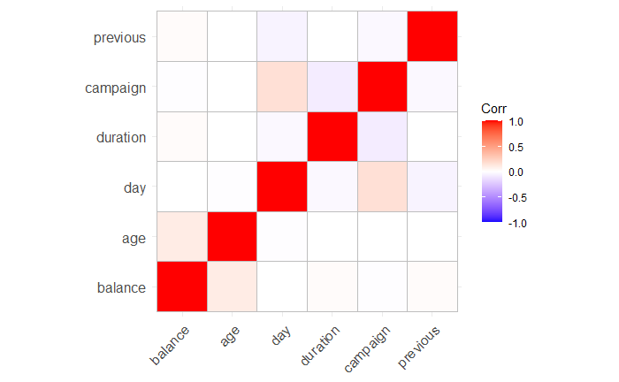
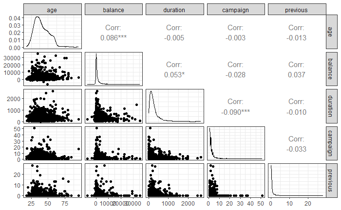
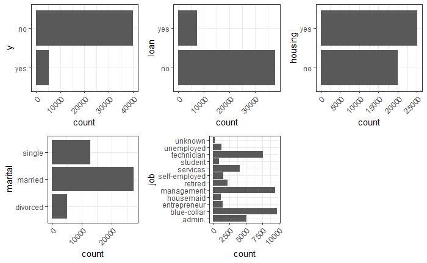
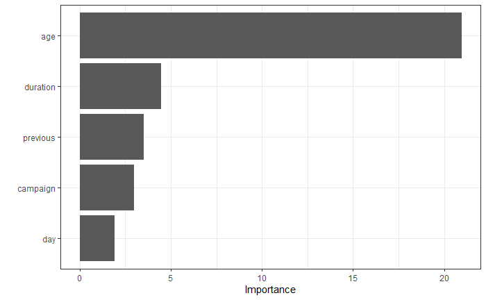

#  Predictive Customer Analytics for Banking Campaigns

> **Predicting Bank Customer Behavior: A Data-Driven Approach to Campaign Effectiveness and Customer Segmentation**

---

##  Introduction

Direct marketing campaigns are one of the primary tools banks use to acquire new customers and promote financial products. However, without data-driven targeting, these campaigns are costly and inefficient. Reaching thousands of customers who are unlikely to respond while missing those who would. The ability to predict customer behavior before launching a campaign is therefore a significant competitive advantage.
This project applies predictive analytics to a real-world banking dataset collected from direct marketing phone campaigns conducted by a Portuguese bank. Using a combination of regression and classification models, this project investigates two core dimensions of customer behavior: what drives a customer's account balance, and what predicts their likelihood of subscribing to a term deposit product.
The analysis is structured across two analytical tracks. The first track is the quantitative analysis; using Multiple Linear Regression, Lasso Tuned Regression, and Generalized Additive Models (GAM) to identify and predict the factors influencing individual account balances. The second track is the qualitative analysis using Logistic Regression, Tuned Random Forest, and Tuned Gradient Boosted Models to classify customers likely to subscribe to a term deposit. Together, these two tracks provide a comprehensive, data-driven view of customer behavior that can directly inform campaign strategy, customer segmentation, and resource allocation.

##  Problem Statement

Banks operating direct marketing campaigns frequently struggle to answer critical performance questions in real time. Which customers are financially valuable? Who is likely to respond to a product offer? Without predictive modeling, marketing teams rely on broad demographic assumptions, historical averages, and manual segmentation; approaches that are slow, inconsistent, and increasingly inadequate in a data-rich environment.
The core problem this project addresses is twofold. First, the bank lacks a reliable model to predict individual account balances from customer demographic and campaign data thus limiting its ability to identify and prioritize high-value customers. Second, without a classification model, the bank cannot efficiently predict which customers are likely to subscribe to a term deposit, resulting in wasted campaign resources and missed revenue opportunities. This project addresses both gaps through rigorous statistical modeling and machine learning.

##  Project Objectives & Business Questions

This project pursues two primary analytical objectives:
####  Objective 1
Quantitative Analysis: Predicting Account Balance
To identify the demographic and campaign factors that significantly predict a customer's average account balance, and to determine which regression model best captures those relationships.

Which numerical variables: age, contact duration, campaign frequency, days since last contact, and prior interactions significantly predict account balance?
Do non-linear relationships exist between predictors and balance, and does accounting for them improve model performance?
Which model: Multiple Linear Regression, Lasso Tuned Regression, or GAM produces the most accurate balance predictions?

####  Objective 2 
Qualitative Analysis: Predicting Term Deposit Subscription
To identify the categorical and demographic factors that influence a customer's decision to subscribe to a term deposit, and to determine which classification model best predicts subscription likelihood.

Which factors; job type, marital status, housing loan status, personal loan status, and contact type most influence subscription decisions?
How does subscription likelihood vary across customer segments defined by employment, financial obligations, and communication history?
Which model: Logistic Regression, Tuned Random Forest, or Tuned Gradient Boosted Model most accurately classifies customers as likely subscribers?

##  Data Description

The dataset used in this project is the Bank Marketing Dataset sourced from the UCI Machine Learning Repository. It was collected from direct marketing phone campaigns conducted by a Portuguese banking institution between 2008 and 2013. The dataset contains 45,211 records and 16 variables capturing customer demographics, financial attributes, and campaign-related information. The outcome variables are account balance (continuous, used for regression) and subscription status (binary: yes/no, used for classification).

**Dataset Summary**

| Attribute | Description |
|------------|------------|
| Source | UCI Machine Learning Repository |
| Domain | Banking & Marketing |
| Records | 45,211 |
| Variables | 16 |
| Period | 2008–2013 |
| Regression Target | Balance (Account Balance) |
| Classification Target | y (Term Deposit Subscription) |

**Variable Description**

| Variable | Type | Description |
|----------|------|-------------|
| age | Numerical | Customer's age in years |
| balance | Numerical | Average annual account balance in euros (Regression Target) |
| duration | Numerical | Duration of the last contact in seconds |
| campaign | Numerical | Number of contacts made during the current campaign |
| previous | Numerical | Number of contacts made before the current campaign |
| day | Numerical | Day of the month of the last contact |
| job | Categorical | Type of employment |
| marital | Categorical | Marital status |
| education | Categorical | Education level |
| default | Categorical | Has credit in default? (Yes/No) |
| housing | Categorical | Has housing loan? (Yes/No) |
| loan | Categorical | Has personal loan? (Yes/No) |
| contact | Categorical | Communication type used |
| month | Categorical | Month of the last contact |
| poutcome | Categorical | Outcome of the previous marketing campaign |
| y | Categorical | Subscribed to term deposit? (Yes/No) – Classification Target |

**Target Variables**

| Analysis Type | Target Variable | Description |
|--------------|----------------|-------------|
| Multiple Linear Regression | balance | Predict customer account balance |
| Classification Models | y | Predict whether a customer subscribes to a term deposit |

###  Data Preparation & Cleaning

**Cleaning steps**

1. Loaded dataset and standardized column names using "clean_names()"
2. Removed all rows with missing values using "na.omit()"
3. Confirmed zero duplicate records
4. Encoded the target variable y as a factor with levels yes / no
5. Applied "SMOTE" oversampling to address class imbalance in the classification dataset
6. Normalized all numeric predictors and encoded categorical variables as dummy variables using "recipe()" and "bake()"
7. Applied a "60/40" train/test split for both analytical tracks

## Exploratory Data Analysis & Visualization

###  Dataset Overview

The dataset captures customer demographics, financial profile, and campaign engagement history. Key summary statistics include:

1. **Age:** ranges from 18 to 95 years, median of 39
2. **Balance:** ranges from 0 to 102,127 euros, mean of 1,415 and median of 485; strongly right-skewed
3. **Duration:** ranges from 0 to 4,918 seconds, mean of 258.2 and median of 180
4. **Campaign:** most customers were contacted a small number of times; the variable is right-skewed with a few high-frequency outliers

###  Key Findings from Visualizations

**Histograms (Numeric Variable Distributions):**
All numeric variables exhibit right-skewed distributions, particularly balance and previous. This skewness suggests that variable transformation may improve model performance and that outliers at higher balance values could influence predictions; a pattern confirmed in the regression modeling results.

**Correlation Heatmap:**
The correlation matrix revealed low to moderate correlations among numeric variables, with the strongest relationships observed between:

1. Balance and Age
2. Balance and Duration
3. Previous and Campaign

Multicollinearity is not a significant concern, with VIF scores close to 1 across all predictors supporting the validity of the regression models.

**Pairwise Plot:**
Significant pairwise correlations were found between Balance and Duration, and a weak negative correlation between Balance and Campaign (-0.085). These relationships are consistent with the expectation that longer, more meaningful contacts correlate with higher-value customers.

**Bar Plots — Categorical Variables:**
The target variable y is heavily imbalanced, the majority of customers did not subscribe, requiring SMOTE resampling before classification modeling
The poutcome variable contains a large "unknown" category that may introduce noise
Job type distribution shows most customers are in management, blue-collar, or technician roles

##  Quantitative Analysis — Predicting Account Balance

***Why These Models?***
Regression models were selected to address the quantitative business objective: predicting a continuous numerical outcome (account balance) from demographic and campaign predictors. Three models of increasing complexity were evaluated to identify the best approach for this dataset.

### Regression Models (Predicting Account Balance)
| Model | Purpose |
|---|---|
| Multiple Linear Regression | Baseline balance prediction |
| Lasso Regression (Tuned) | Regularized model with feature selection |
| Generalized Linear Model (GLM) | Non-normal distribution handling |

**Evaluation Metrics:** RMSE, R², Residual Diagnostics, VIF, Actual vs. Predicted plots, Variable Importance

####  Model 1 — Multiple Linear Regression
Multiple Linear Regression was used as the baseline model for predicting account balance. This model estimates the linear relationship between a set of demographic and campaign predictors and the continuous outcome variable average account balance. As the foundational regression approach, it provides an interpretable benchmark against which more complex models are evaluated.
The model was trained on the regression dataset using all available numerical predictors. Residual diagnostic plots were examined to assess assumptions of normality, homoscedasticity, and independence. Variable Inflation Factor (VIF) scores confirmed no severe multicollinearity among predictors.

#### Results

| Metric | Value |
|---------|-------:|
| RMSE | 3,004.647 |
| R² | 0.010 |
| MAE | 1,505.722 |

**Key findings:** 
1. All predictors were statistically significant (p < 0.05), no pruning required
2. VIF values close to 1 confirmed no multicollinearity
3. Age emerged as the most important predictor by variable importance score
4. Residual diagnostics revealed heteroscedasticity and non-normal residuals, suggesting the linear model does not fully capture the data's structure
5. The actual vs. predicted plot showed predictions clustered at low balance values, with poor accuracy for high-balance customers

####  Model 2 — Lasso Tuned Regression
Lasso Regression was applied to address the risk of overfitting present in the baseline model and to perform automatic feature selection. By adding a regularization penalty (lambda) that shrinks less important variable coefficients toward zero, Lasso identifies only the most influential predictors of account balance producing a leaner, more generalizable model.
The optimal lambda value was selected through cross-validation. Variables with low predictive contribution were removed from the model, reducing dimensionality and improving out-of-sample performance.

#### Results

| Metric | Value |
|---------|-------:|
| RMSE | 3,050.961 |
| R² | 0.008 |
| MAE | 1,505.330 |
| Best Lambda | 0.01 |

**Key findings:** 
1. The optimal lambda of 0.01 indicates a minimal penalty was sufficient, suggesting the predictors were already relatively clean
2. Age remained the dominant predictor — its coefficient stayed large even as lambda increased and other coefficients shrunk toward zero
3. The coefficient path plot confirmed that previous, duration, campaign, and day progressively lose influence as regularization increases
4. Performance was marginally weaker than the MLR baseline, suggesting overfitting was not the primary issue and the dataset may lack key predictors

####  Model 3 — Generalized Additive Model (GAM)
GAM was employed to capture non-linear relationships between predictors and account balance that the linear models could not accommodate. Rather than fitting straight lines, GAM fits smooth curves to each predictor, allowing the model to flexibly represent the true shape of each relationship.
This approach was particularly motivated by the right-skewed distribution of balance and the expectation that variables like age and campaign frequency would exhibit non-linear effects. for example, balance may increase with age up to a point before plateauing or declining.

#### Results

| Metric | Value |
|---------|-------:|
| RMSE | 2,998.206 |
| R² | 0.015 |
| MAE | 1,499.370 |

**Key findings:** 
1. GAM achieved the best performance across all three metrics — lowest RMSE, highest R², and lowest MAE
2. Smooth term plots revealed meaningful non-linear patterns:
- Age shows an exponential increase with balance — the relationship is not linear
- Duration has a positive near-linear effect on balance
- Campaign shows a slight upward trend with high variation at larger values
- Day exhibits a cyclical pattern with peaks on specific days
- Previous shows a steep drop after a certain threshold — diminishing returns from repeated contacts
3. Despite being the best model, the overall R² of 0.015 indicates the predictors in this dataset explain very little of the variance in balance — suggesting other key variables (income, credit score, etc.) are missing

## Regression Model Comparison

| Model | RMSE | R² | MAE | Key Strength |
|-------|-----:|---:|----:|--------------|
| Multiple Linear Regression | 3,004.647 | 0.010 | 1,505.722 | Interpretable baseline model |
| Lasso Regression | 3,050.961 | 0.008 | 1,505.330 | Performs feature selection through regularization |
| Generalized Additive Model (GAM) ⭐ | **2,998.206** | **0.015** | **1,499.378** | Captures non-linear relationships between predictors and account balance |

Winner: GAM — lowest RMSE and MAE, highest R²

##  Qualitative Analysis — Predicting Term Deposit Subscription

***Why These Models?***
Classification models were selected to address the qualitative business objective: predicting a binary outcome (subscribed: yes/no) from demographic and campaign variables. The dataset's class imbalance (majority non-subscribers) required SMOTE preprocessing before modeling. Three models were evaluated from baseline to ensemble.

### Classification Models (Predicting Term Deposit Subscription)
| Model | Purpose |
|---|---|
| Logistic Regression | Baseline classification |
| Random Forest (Tuned) | Ensemble method with feature importance |
| Gradient Boosted Trees (Tuned) | High-performance boosting model |

**Evaluation Metrics:** Accuracy, ROC-AUC, Sensitivity, Specificity, Precision, F1-Score, Optimal Threshold (Best Cutoff)

a. **Regression:** Identified contact duration, campaign frequency, and prior interactions as top predictors of account balance
b. **Classification:** Random Forest and Gradient Boosted Trees outperformed Logistic Regression in predicting term deposit subscriptions
c. **ROC-AUC analysis** with optimal threshold tuning improved model sensitivity for identifying high-probability subscribers
d. **Variable Importance Plots** revealed job type, housing loan status, and contact duration as the most influential classification features

#### Data Preprocessing for Classification
Before modeling, the classification dataset was preprocessed using a "recipe()" pipeline:
1. Normalized all numeric predictors
2. Encoded all categorical predictors as dummy variables
3. Removed zero-variance predictors
4. Applied SMOTE (Synthetic Minority Oversampling Technique) with over_ratio = 0.5 to address class imbalance
5. Split into 60% training / 40% test sets using stratified sampling

#### Model 1 — Logistic Regression
Establish a baseline classification model providing interpretable odds ratios and probability estimates for subscription.
Standard logistic regression fitted on the full SMOTE-balanced training dataset using all available predictors.

**Key Findings:**
1. Provided a solid baseline with good accuracy
2. Duration and campaign were the strongest predictors of subscription
3. Less effective at capturing complex variable interactions compared to ensemble models

#### Model 2 — Tuned Random Forest
Capture complex interactions between variables through ensemble tree-based modeling, with hyperparameter tuning to optimize performance.
Random Forest with mtry and trees tuned via 3-fold cross-validation over a grid of values. Final model parameters: mtry = 19, trees = 1,000. Variable importance measured using impurity.

**Key Findings:**
1. Outperformed Logistic Regression across all metrics
2. Variable importance plot identified duration and campaign as the top predictors of subscription
3. Month appeared as the least significant predictor
4. Strong ROC curve indicating excellent discrimination between subscribers and non-subscribers

##  Discussion

---

##  Conclusion

---

##  Business Impact

| Insight | Actionable Recommendation |
|---|---|
| Contact duration is a strong predictor | Prioritize longer, quality engagements over volume |
| Job type and loan status drive subscription | Segment campaigns by employment and financial profile |
| High campaign frequency reduces conversion | Reduce contact frequency; focus on high-probability leads |
| Prior interactions signal interest | Re-target customers with previous positive engagements |

---

## 🛠️ Tools & Technologies

| Tool | Use |
|---|---|
| **R** | Core analysis and modeling |
| **tidyverse** | Data wrangling and visualization |
| **tidymodels** | Model training, tuning, and evaluation |
| **randomForest / xgboost** | Ensemble and boosted models |
| **glmnet** | Lasso regularization |
| **ggplot2** | Data visualization |
| **Quarto** | Reproducible reporting |

---

